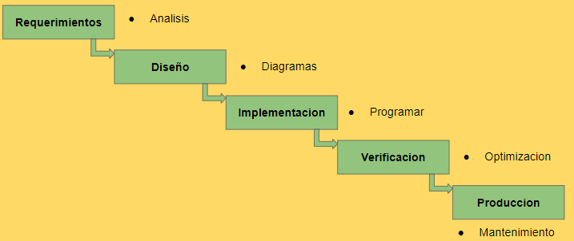

## Archivo principal del proyecto ICD_MDS
Con  este archivo se pretende que los participantes tengas una vision general de como va el proceso de desarrollo del sistema, para informacion mas detallada [Info.md](https://github.com/joeljesusmota/ICD_MDS/blob/master/Info.md)
> Este archivo esta sujeto a modificaciones constantes

### *Enlaces utiles*
- [Tablero de tareas "kanban"](https://github.com/joeljesusmota/ICD_MDS/projects/1)
- [Foro Q10](https://site4.q10.com/EducacionVirtual/Foro/6517/Detalle?idLeccion=11538&cursoArchivado=False)
- [Bocetos de la interfaz](https://ninjamock.com/s/7ZS2RGx)
- [Diagrama Entidad Relacion "E-R"](https://www.lucidchart.com/invitations/accept/5dee8b75-2154-45b2-91a9-305a5dd72529)

### *Enlaces a recursos*
> Estos enlaces correspoden a la documentacion y/o articulos de las diferentes herramientas y recursos que se usaran a lo largo del proyecto

- 1 [Metodologia RUP **#ArticuloPrincipal**](https://metodoss.com/metodologia-rup/)
- 2 [Bootstrap **#Documentacion**](https://getbootstrap.com/docs/4.4/getting-started/introduction/)
- 3 [Bootstrap Grid **#Documentacion**](https://getbootstrap.com/docs/4.4/layout/grid/)
- 4 [Patron MVC en asp.net core **#Articulo**](https://docs.microsoft.com/en-us/aspnet/core/mvc/overview?view=aspnetcore-3.1)
- 5 [Sintaxis de Razor **#Articulo**](https://docs.microsoft.com/en-us/aspnet/web-pages/overview/getting-started/introducing-razor-syntax-c)
- 6 [Entity Framenwork Core **#Tutorial**](https://docs.microsoft.com/en-us/ef/core/get-started/?tabs=netcore-cli)
- 7 [Diseño web responsive **#Articulo**](https://developer.mozilla.org/en-US/docs/Learn/CSS/CSS_layout/Responsive_Design)

##### Mas enlaces

- [Guia para documentar Software](https://cs.uns.edu.ar/~ldm/mypage/data/oc/info/guia_para_la_documentacion_de_proyectos_de_software.pdf)
- [MODELO ENTIDAD - RELACIÓN (CONCEPTOS BÁSICOS)](https://www.youtube.com/watch?v=l5PDQtUVye8)

#### *Indice*

- 1 [Objetivos](#1)
- 2 [Excepciones](#2)
- 3 [Aplicando RUP](#3)
    - 3.1 [Analisis y requerimientos](#3.1)
    - 3.2 [Diseño](#3.2)

### Objetivos del proyecto

Aplicar los conocimientos de metodologías de desarrollo para tener productos con mayor calidad, si bien el proyecto puede ser utilizado para su comercialización, el mismo es ficticio, ya que su principal función es la de mostrar a los contribuidores del proyecto el como implementar las técnicas correctas para el análisis, diseño, desarrollo, pruebas y entrega de un software web con la metodologia RUP.

### Excepciones

Hasta ahora los contribuyentes al proyecto no son muchos, el proyecto tampoco es completo aun que tiene todo lo primordial para considerarlo un proyecto web decente, por lo tanto no todas las disciplinas y faces de la metodologia rup deben ser cumplidas al pie de la letra, entre las excepciones estan...

- Modelo de negocio
- Casos de uso
> Con el tiempo se sumaran mas de ser necesario

### Aplicando RUP

Esta parte del documento es donde se definiran como aplicar RUP a nuestro ciclo de desarrollo y sus diferentes parte y elementos, las tareas pendiente respecto al proyecto esta en el tablero

> Ciclo de desarrollo

> Grafico de RUP

#  Analisis y requerimientos

##### Requerimientos del cliente

##### Interpretacion
En esta etapa vamos a documentar el analisis y la interpretacion de los requerimientos del cliente, de igual modo daremos respuesta al cliente documentando la vision que tenemos sobre el proyecto en cuestion

[Documento](https://docs.google.com/document/d/1g4ZhIbmYFUz9I2RtdG7E1AWGQQWh-keRwI5a3erDN44/edit?usp=sharing)

# Diseño

- [Bocetos de la interfaz](https://ninjamock.com/s/7ZS2RGx)
